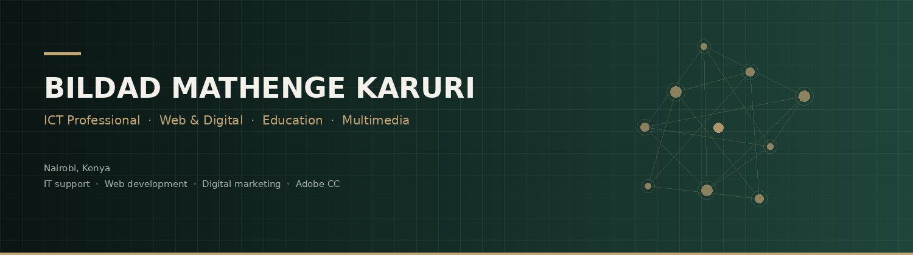

<div align="center">
  
</div>

<br>

# Bildad Mathenge Karuri

**ICT Professional · Web Developer · Digital Marketer · Educator**

Nairobi, Kenya  
[bildadmathenge49@gmail.com](mailto:bildadmathenge49@gmail.com) · [Portfolio](https://bildad-math.github.io)

IT professional and educator with **2+ years** of hands-on experience across ICT instruction, technical support, web development, digital marketing, social media, and multimedia production.

I take digital work from the ground up — **brand, website, hosting, content, and growth** — and I teach the same skills in the classroom.

---

## Currently

| Role | Organisation |
| --- | --- |
| Primary ICT Teacher & Class Teacher | Mustard Baraka Primary School |
| Web Designer & Social Media Manager | Global Impactive Solutions (GIS) Ltd |
| Marketing Lead — Brand, Digital & Content | Upfront College Beauty School |

---

## What I do

- **ICT & education** — curriculum delivery, digital literacy, computer-lab support, student mentorship
- **IT support** — Windows troubleshooting, hardware/software maintenance, basic networking, software installation
- **Web** — HTML, CSS, JavaScript, TypeScript, React, Python, MySQL, CMS, hosting, domain & DNS, deployment
- **Digital marketing** — content strategy, Instagram, LinkedIn, TikTok, Meta Business Suite, campaigns, reporting
- **Multimedia** — photography, videography, Adobe Premiere Pro, After Effects, Photoshop, Illustrator, InDesign, Canva, Figma

---

## Selected work

**[Global Impactive Solutions — website platform](https://github.com/Bildad-Math/gis-website)**  
Corporate website and CMS built from scratch: React, TypeScript, tRPC, MySQL. Hosting, domain/DNS, deployment and ongoing social operations (Instagram + LinkedIn).

**[Upfront College Beauty School](https://github.com/Bildad-Math/upfront-college-digital-launch)**  
Brand identity, website and social presence built from zero ahead of launch. Campaigns that generated student enquiries and enrolments.

**[Python ICT Lab](https://github.com/Bildad-Math/python-ict-lab)**  
Classroom-ready Python tools for ICT trainers — lab inventory tracking and a basic-networking quiz.

**[Dandora Greenlight VTC](https://github.com/Bildad-Math/dandora-greenlight-digital-growth)**  
ICT training in Python, computer maintenance and networking, plus Instagram/TikTok content that generated enrolment enquiries and confirmed enrolments.

---

## Technical stack

```text
IT        Windows · Hardware · Troubleshooting · Maintenance · Networking · MySQL
Web       HTML · CSS · JavaScript · TypeScript · React · Python · CMS · Hosting · DNS
Adobe     Photoshop · Premiere Pro · After Effects · Illustrator · InDesign
Digital   Meta Business Suite · Instagram · TikTok · LinkedIn · Canva · Figma
```

---

## Education

**Diploma in Information Technology** · 2023–2025  
**Certificate — Minds and Beyond** · November 2024  
**KCSE** · 2022

---

## Contact

Open to **ICT, web, digital marketing, multimedia and education** work.

- Email: [bildadmathenge49@gmail.com](mailto:bildadmathenge49@gmail.com)
- Location: Nairobi, Kenya
- Phone: +254 794 528 346
- GitHub: [github.com/Bildad-Math](https://github.com/Bildad-Math)
- LinkedIn: [linkedin.com/in/bildad-karuri-0488ab3a1](https://www.linkedin.com/in/bildad-karuri-0488ab3a1/)
